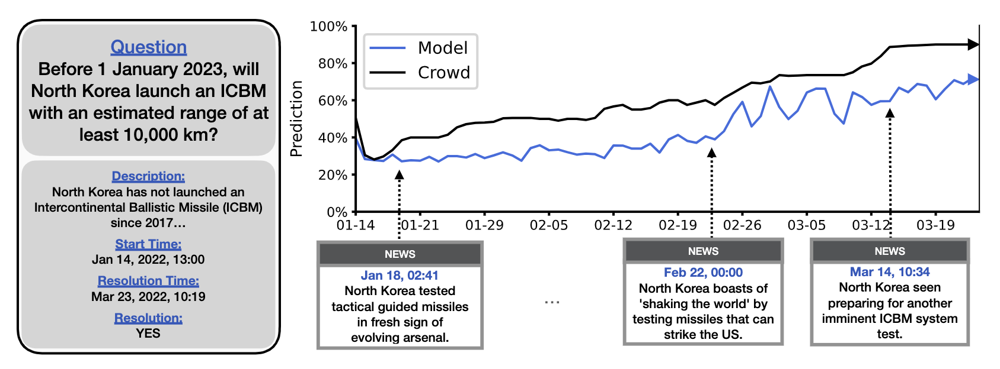

# Forecasting Future World Events with Neural Networks

This is the repository for "[Forecasting Future World Events with Neural Networks](http://arxiv.org/abs/2206.15474)"  
by [Andy Zou](https://andyzoujm.github.io/), [Tristan Xiao](https://www.linkedin.com/in/tristan-xiao/), [Ryan Jia](https://www.linkedin.com/in/ryanjia/), [Joe Kwon](joekwon.io), [Mantas Mazeika](https://www.linkedin.com/in/mmazeika/), [Richard Li](https://www.linkedin.com/in/lirichard23/), [Dawn Song](https://people.eecs.berkeley.edu/~dawnsong/), [Jacob Steinhardt](https://www.stat.berkeley.edu/~jsteinhardt/), [Owain Evans](https://owainevans.github.io/), and [Dan Hendrycks](https://danhendrycks.com/).



## Introduction

Forecasting future world events is a challenging but valuable task. Forecasts of climate, geopolitical conflict, pandemics and economic indicators help shape policy and decision making. In these domains, the judgment of expert humans contributes to the best forecasts. Given advances in language modeling, can these forecasts be automated? To this end, we introduce Autocast, a dataset containing thousands of forecasting questions and an accompanying news corpus. Questions are taken from forecasting tournaments, ensuring high quality, real-world importance, and diversity. The news corpus is organized by date, allowing us to precisely simulate the conditions under which humans made past forecasts (avoiding leakage from the future). We test language models on our forecasting task and find that performance is far below a human expert baseline. However, performance improves with increased model size and incorporation of relevant information from the news corpus. In sum, Autocast poses a novel challenge for large language models and improved performance could bring large practical benefits.

## Autocast Dataset

The latest version of the [Autocast dataset can be downloaded here](https://people.eecs.berkeley.edu/~hendrycks/autocast.tar.gz). The collection of news articles will be released soon. For more details on how to use the Autocast dataset, please refer to our short demonstration in `usage.ipynb`.

Each question has the following fields:
  ```json
  {
    "id":                "unique identifier (str)",
    "question":          "question body (str)",
    "background":        "question context/details (str)",
    "qtype":             "question type (str)",
    "status":            "question status (str)",
    "choices":           "choices or possible ranges (List or Dict)",
    "answer":            "question resolution (str or float)",
    "crowd":             "human crowd forecasts over time (List)",
    "publish_time":      "publish timestamp (str)",
    "close_time":        "close timestamp (str)",
    "prediction_count":  "number of crowd predictions (int)",
    "forecaster_count":  "number of crowd forecasters (int)",
    "tags":              "question category (List)",
    "source_links":      "source links from comments (List)"
  }
```

We obtained permission from [Metaculus](https://www.metaculus.com/) to host the dataset on GitHub for research purposes only.

## IntervalQA Dataset

Motivated by the difficulty of forecasting numbers across orders of magnitude (e.g. global cases of COVID-19 in 2022), we also curate IntervalQA, a dataset of numerical questions and metrics for calibration.

[Download the IntervalQA dataset here](https://people.eecs.berkeley.edu/~hendrycks/intervalqa.tar.gz).

## Citation

If you find this useful in your research, please consider citing:

    @article{zouforecasting2022,
      title={Forecasting Future World Events with Neural Networks},
      author={Andy Zou and Tristan Xiao and Ryan Jia and Joe Kwon and Mantas Mazeika and Richard Li and Dawn Song and Jacob Steinhardt and Owain Evans and Dan Hendrycks},
      journal={arXiv preprint arXiv:2206.15474},
      year={2022}
    }
