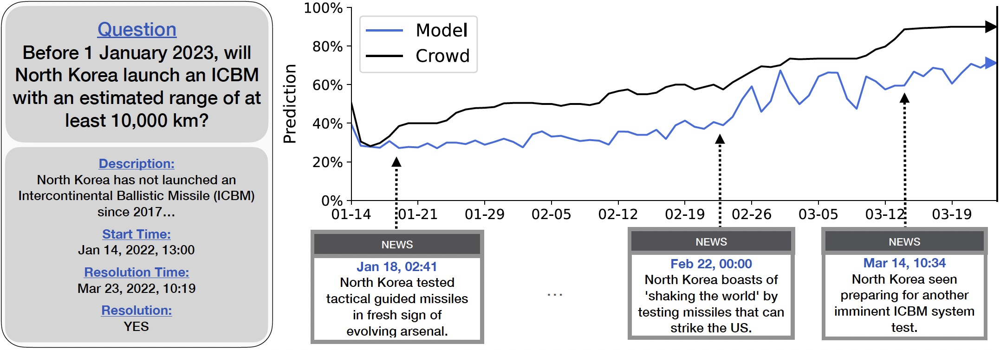

# Forecasting Future World Events with Neural Networks



## Introduction

Forecasting future world events is a challenging but valuable task. Forecasts of climate, geopolitical conflict, pandemics and economic indicators help shape policy and decision making. In these domains, the judgment of expert humans contributes to the best forecasts. Given advances in language modeling, can these forecasts be automated? To this end, we introduce Autocast, a dataset containing thousands of forecasting questions and an accompanying news corpus. Questions are taken from forecasting tournaments, ensuring high quality, real-world importance, and diversity. The news corpus is organized by date, allowing us to precisely simulate the conditions under which humans made past forecasts (avoiding leakage from the future). Motivated by the difficulty of forecasting numbers across orders of magnitude (e.g. global cases of COVID-19 in 2022), we also include a dataset of numerical questions and metrics for calibration. We test language models on our forecasting task and find that performance is far below a human expert baseline. However, performance improves with increased model size and incorporation of relevant information from the news corpus. In sum, Autocast poses a novel challenge for large language models and improved performance could bring large practical benefits.

Read the paper [here]().

## Autocast Dataset
The Autocast dataset and the collection of news articles can be downloaded [here](https://drive.google.com/drive/folders/16UIv25P2GL5LMLrFYkP-s_WDMHm_OzYG?usp=sharing).

Each question has the following fields:
  ```
  question = {
    'id',
    'question',
    'background',
    'qtype', # ['t/f', 'mc', 'num']
    'status', # ['Resolved', 'Closed', 'Active']
    'choices',
    'answer',
    'publish_time',
    'close_time',
    'prediction_count',
    'forecaster_count',
    'tags',
    'source_links'
   }
  ```

We obtained permission from [Metaculus](https://www.metaculus.com/) to host the dataset on GitHub for research purposes only.

## IntervalQA
The dataset of numerical calilbration questions can be downloaded [here](https://drive.google.com/drive/folders/1OAwiW47rXRIQ543YIXWSiqv5XVtostbR?usp=sharing).

## Citation

If you find this useful in your research, please consider citing:

    @article{zou2022forecasting,
      title={Forecasting Future World Events with Neural Networks},
      author={Andy Zou and Tristan Xiao and Ryan Jia and Joe Kwon and Mantas Mazeika and Richard Li and Dawn Song and Jacob Steinhardt and Owain Evans and Dan Hendrycks},
      journal={arXiv preprint arXiv:},
      year={2022}
    }
